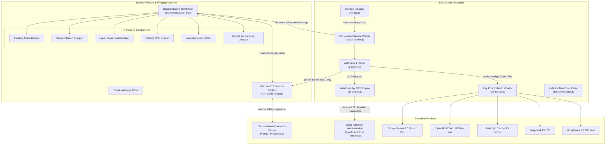
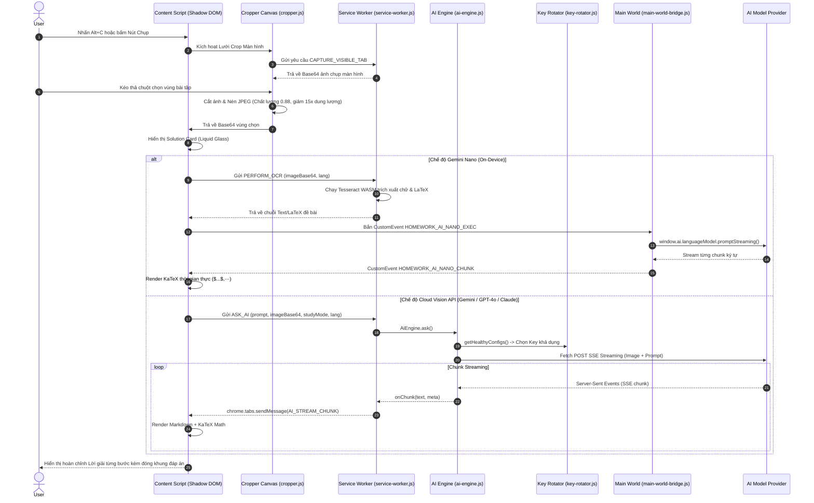

# Kiến trúc Kỹ thuật Toàn diện (System Architecture)

Tài liệu này mô tả chi tiết toàn bộ kiến trúc kỹ thuật, luồng dữ liệu (Data Flow), cơ chế cách ly Shadow DOM, bộ định tuyến AI Đa Chiến lược, bộ xoay vòng API Key Pool và hệ thống Local OCR WebAssembly của **Homework Helper**.

---

## 1. Sơ đồ Kiến trúc Hệ thống Tổng thể (High-Level Architecture)



---

## 2. Luồng Xử lý Tuần tự khi Chụp ảnh & Giải bài tập (Crop & Solve Lifecycle)

Sơ đồ tuần tự thể hiện chi tiết từng bước từ khi người dùng ấn `Alt+C` đến khi câu trả lời KaTeX hiển thị mượt mà trên màn hình:



---

## 3. Các Thành phần Cốt lõi (Core Components Breakdown)

### 3.1. Cô lập Giao diện với Closed Shadow DOM (`extension/content/overlay.js`)
- **Vấn đề**: Các trang web học tập (Canvas, Quizizz, Google Forms, D2L...) có hàng nghìn dòng CSS phức tạp. Nếu chèn HTML trực tiếp, CSS của trang web sẽ làm vỡ giao diện extension, hoặc ngược lại CSS của extension làm hỏng trang web.
- **Giải pháp**: 
  - Toàn bộ giao diện được render bên trong một `ShadowRoot` dạng `closed`:
    ```javascript
    const host = document.createElement('div');
    host.id = 'homework-helper-host';
    const shadow = host.attachShadow({ mode: 'closed' });
    ```
  - Thư viện KaTeX CSS, font chữ và các stylesheet Liquid Glass được nhúng cục bộ bên trong Shadow DOM này, đảm bảo độ độc lập 100%.

### 3.2. Cầu nối Main World Execution Context (`extension/content/main-world-bridge.js`)
- **Vấn đề**: Chrome Extension Content Script chạy trong một *Isolated World* (thế giới riêng biệt). Tuy nhiên, API **Prompt API (`window.ai`)** của Google Chrome chỉ được kích hoạt trong *Main World* (ngữ cảnh chính của trang web).
- **Giải pháp**:
  - `loader.js` chèn một thẻ `<script src="content/main-world-bridge.js">` trực tiếp vào thẻ `<head>` của trang web.
  - Hai bên giao tiếp thông qua hệ thống `CustomEvent` có gắn mã định danh `requestId`:
    - `HOMEWORK_AI_NANO_EXEC`: Gửi prompt và system prompt sang Main World.
    - `HOMEWORK_AI_NANO_CHUNK`: Nhận các chunk text phản hồi về Content Script.
    - `HOMEWORK_AI_NANO_FINISH`: Báo hiệu hoàn tất.
    - `HOMEWORK_AI_NANO_ERROR`: Báo lỗi nếu thiếu cờ Chrome.

### 3.3. Bộ Định tuyến Đa Chiến lược (AI Routing Engine)
Được triển khai tại `extension/background/ai-engine.js`, hỗ trợ 4 chiến lược vận hành:

1. **`prefer_nano` (Chiến lược Mặc định)**:
   - *Văn bản thuần túy (Chat, Bôi đen text, Câu hỏi lý thuyết)*: 100% chạy trên **Chrome Gemini Nano** On-Device (Tốc độ mili-giây, không tốn token, bảo mật riêng tư).
   - *Hình ảnh / Chụp đề bài*: Tự động định tuyến sang **Gemini 2.5 Flash / GPT-4o Vision** (hoặc chạy Local OCR nếu người dùng không cài API key).
2. **`prefer_config`**:
   - Ưu tiên sử dụng danh sách các API Key đám mây đã cấu hình.
   - Khi gặp sự cố mạng, lỗi 429 Rate Limit hoặc hết hạn ngạch ➔ **Tự động Fallback sang Gemini Nano** mà không làm gián đoạn trải nghiệm của người dùng.
3. **`nano_only`**:
   - 100% Cục bộ On-Device. Tuyệt đối không gửi bất kỳ dữ liệu nào ra máy chủ bên ngoài.
4. **`config_only`**:
   - Chỉ sử dụng các API Key được cấp trong bảng Key Pool.

### 3.4. Hệ thống Quản lý Key Pool & Chống Quá tải (Key Rotator & Circuit Breaker)
Được triển khai tại `extension/background/key-rotator.js`:
- **Load Balancing (Cân bằng tải)**: Phân phối yêu cầu đều theo thuật toán Round-Robin hoặc Random qua danh sách các Key đang hoạt động.
- **Circuit Breaker (Tự ngắt mạch khi lỗi)**:
  - Khi một Key nhận mã lỗi `HTTP 429 (Too Many Requests)` hoặc `HTTP 503`:
    ```javascript
    keyState.failureCount++;
    keyState.cooldownUntil = Date.now() + 60000; // Đưa key vào hàng chờ nghỉ 60 giây
    ```
  - Hệ thống tự động chuyển sang Key tiếp theo trong Pool để tiếp tục câu trả lời mà người dùng không hề nhận thấy sự gián đoạn.

### 3.5. Bộ máy Local WebAssembly OCR (`extension/shared/ocr-engine.js`)
- Sử dụng mô hình Tesseract WebAssembly Quantized LSTM chạy trực tiếp trong luồng Web Worker của trình duyệt.
- **Đóng gói sẵn (Bundled Pack)**: Lưu trữ sẵn 3 file mô hình cốt lõi trong `extension/assets/ocr/`:
  - `vie.traineddata` (Tiếng Việt)
  - `eng.traineddata` (Tiếng Anh & Ký hiệu Latin)
  - `equ.traineddata` (Ký hiệu Toán học: $\alpha, \beta, \pi, \int, \sqrt{}, \Delta$)
- **Cơ chế Cache IndexedDB**: Đối với các ngôn ngữ quốc tế khác (Nhật, Hàn, Trung, Pháp, Đức...), file `.traineddata` được tải về theo nhu cầu (On-Demand) từ CDN và lưu vào database `HomeworkAi_Ocr_DB` của IndexedDB.
- **Xử lý hậu kỳ Toán học (Math Post-Processing)**:
  - Tự động chuẩn hóa các ký tự quét được thành chuẩn LaTeX:
    - Sửa căn bậc hai: `V(x)` hoặc `v(x)` ➔ `\sqrt{x}`
    - Sửa số mũ: `x2` ➔ `x^2`, `y3` ➔ `y^3`
    - Sửa ký hiệu Hy Lạp: `alpha` ➔ `\alpha`, `delta` ➔ `\Delta`

---

## 4. Mô hình Dữ liệu Đa Hội thoại (Multi-Session Storage Architecture)

Được lưu trữ an toàn trong `chrome.storage.local` với quyền `"unlimitedStorage"`:

```typescript
interface StorageSchema {
  // Routing & Settings
  routingStrategy: 'prefer_nano' | 'prefer_config' | 'nano_only' | 'config_only';
  studyMode: 'step-by-step' | 'direct' | 'hint' | 'explain' | 'translate';
  outputLanguage: string; // 'vi' | 'en' | 'es' | 'fr' | 'de' | 'zh-CN' | 'ja' | 'ko'...
  systemPrompt: string;

  // Key Pool
  apiConfigs: Array<{
    id: string;
    provider: 'gemini' | 'openai' | 'claude' | 'deepseek' | 'groq' | 'openrouter' | 'custom';
    name: string;
    model: string;
    apiKey: string;
    baseUrl?: string;
    isEnabled: boolean;
  }>;
  activeConfigId: 'auto' | string;
  rotationStrategy: 'round-robin' | 'random';

  // Multi-Session Chat Threads
  activeConversationId: string;
  conversations: Array<{
    id: string;
    title: string;
    thumbnail?: string; // Base64 JPEG cropped image
    createdAt: number;
    updatedAt: number;
    messages: Array<{
      role: 'user' | 'assistant';
      content: string;
      image?: string;
      timestamp: number;
    }>;
  }>;

  // Local OCR Models Status
  installedOcrModels: Record<string, {
    lang: string;
    name: string;
    size: string;
    version: string;
    isBundled: boolean;
    isInstalled: boolean;
    updatedAt?: number;
  }>;

  // UI & Liquid Glass Preferences
  fabSize: 'small' | 'normal' | 'large';
  popupOpacity: number; // 40 - 100%
  popupBlur: number;    // 0 - 30px
  toolbarTheme: 'glass-light' | 'glass-dark' | 'cyber-blue' | 'emerald' | 'purple';
  disabledSites: string[];
}
```
