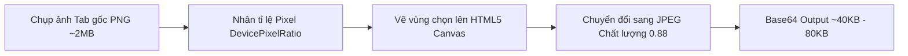

# Tính năng: Khoanh Vùng Chụp Ảnh & Giải Bài Tập (Crop & Solve)

Tính năng **Khoanh Vùng Chụp Ảnh & Giải Bài Tập (Crop & Solve)** là một trong những công cụ trọng tâm nhất của **Homework Helper**, cho phép người học quét nhanh bất kỳ câu hỏi, bài toán phức tạp, đồ thị hàm số hay phương trình hóa học trên màn hình máy tính và nhận lời giải chi tiết từng bước với công thức toán học KaTeX chuẩn mực.

---

## 1. Mô tả Tính năng & Mục đích Sử dụng

- **Mục đích**: Giúp người dùng không cần mất thời gian gõ lại các biểu thức toán học phức tạp (như tích phân $\int$, phân số $\frac{a}{b}$, ma trận, ký hiệu Hy Lạp $\alpha, \beta, \Delta$) hay vẽ lại hình học không gian.
- **Tác vụ hỗ trợ**:
  - Quét đề thi, câu hỏi trắc nghiệm trên các nền tảng trực tuyến.
  - Giải bài toán hình học, đồ thị dao động Vật lý, sơ đồ mạch điện.
  - Cân bằng phương trình Hóa học, chuỗi phản ứng và công thức cấu tạo hữu cơ.
  - Dịch và giải thích các bài đọc hiểu tài liệu ngoại ngữ dài.

---

## 2. Cách thức Hoạt động & Giao diện Tương tác (User Interaction Flow)

### 2.1. Kích hoạt Công cụ Cắt Màn hình
Người dùng có thể kích hoạt bằng 3 cách:
1. **Phím tắt nhanh**: Nhấn tổ hợp phím **`Alt + C`** (trên Windows / Linux) hoặc **`Command + E`** (trên macOS).
2. **Nút Nổi Mép Màn hình (FAB)**: Nhấn vào biểu tượng chiếc kéo nổi ở cạnh phải màn hình.
3. **Thanh Header**: Nhấn nút "Chụp màn hình" trên thanh Header của Chat Drawer hoặc Popup.

### 2.2. Giao diện Chọn Vùng Cắt (Canvas Overlay)
Khi kích hoạt:
1. Tiện ích tự động chụp ảnh tab hiện tại ở độ phân giải gốc của màn hình (hỗ trợ màn hình Retina / High-DPI).
2. Tạm thời ẩn toàn bộ giao diện của tiện ích để tránh bị chụp dính vào ảnh bài tập.
3. Một lớp phủ bán trong suốt phủ kín màn hình kèm con trỏ chuột dạng chữ thập (Crosshair).
4. Người dùng nhấn giữ chuột trái và kéo để tạo khung viền bài tập cần giải:
   - **Khung chữ nhật màu xanh Neon**: Bo quanh vùng được chọn.
   - **Badge kích thước thời gian thực**: Hiển thị kích thước pixel vùng chọn (VD: `420 x 280 px`).
   - **Thanh nút công cụ tức thì**: Gồm nút **Hủy bỏ (X)** và nút **Xác nhận Giải bài tập (Checkmark)**.

---

## 3. Thuật toán Xử lý Hình ảnh Cục bộ & Tối ưu Dung lượng

Triển khai tại tệp `extension/content/cropper.js`:



### Tại sao lại nén sang JPEG 0.88?
- Ban đầu, ảnh chụp tab toàn màn hình dưới dạng PNG có dung lượng lên tới **1.5 MB – 3.0 MB**. Nếu lưu 10-20 câu hỏi vào lịch sử chat, bộ nhớ sẽ rất nặng và làm chậm trình duyệt.
- Tiện ích sử dụng thuật toán chuyển đổi canvas:
  ```javascript
  const croppedDataUrl = canvas.toDataURL('image/jpeg', 0.88);
  ```
- **Kết quả**: Dung lượng giảm **gấp 15 đến 20 lần** (chỉ còn khoảng **40 KB – 80 KB** mỗi ảnh) trong khi toàn bộ chữ viết, dấu câu và công thức toán học vẫn giữ được độ sắc nét hoàn hảo để AI đọc chính xác 100%.

---

## 4. Hiển thị Kết quả trên Solution Card (Liquid Glass Popup)

Ngay sau khi chọn vùng cắt xong, một **Thẻ Kết Quả Nổi (Solution Card)** xuất hiện ngay trên trang:

1. **Hiệu ứng Kính Mờ Liquid Glass**:
   - Nền kính mờ trong suốt thời gian thực (`backdrop-filter: blur(16px)`), không che khuất hoàn toàn trang web.
2. **Kéo thả Tự do (Draggable Header)**:
   - Người dùng có thể nhấn giữ thanh tiêu đề của Solution Card để kéo di chuyển thẻ đến bất kỳ vị trí nào trên màn hình để vừa xem đề bài trên web vừa xem lời giải.
3. **Ảnh Thu Nhỏ (Thumbnail Preview)**:
   - Góc trên của thẻ hiển thị ảnh bài tập đã cắt để người dùng đối chiếu.
4. **Streaming KaTeX Thời Gian Thực**:
   - Lời giải được truyền về theo thời gian thực (Server-Sent Events streaming).
   - Công thức toán học được biên dịch ngay lập tức bằng KaTeX:
     - Công thức nội dòng: `$E = mc^2$` ➔ Hiển thị $E = mc^2$
     - Công thức khối: `$$\int_0^\infty e^{-x^2} dx = \frac{\sqrt{\pi}}{2}$$`
   - Đáp án cuối cùng được **đóng khung viền nổi bật (Boxed Answer)**.
5. **Các Nút Tác vụ Nhanh**:
   - **Nút Copy**: Sao chép toàn bộ lời giải và mã LaTeX vào Clipboard chỉ với 1 chạm.
   - **Nút Câu hỏi kế tiếp (Next Question)**: Tự động kích hoạt lại công cụ cắt ảnh để giải tiếp câu sau.
   - **Nút Mở rộng Chat**: Mở phiên bài tập này sang khung chat lớn để hỏi thêm các câu hỏi đào sâu (Follow-up questions).

---

## 5. Yêu cầu Hệ thống & Quyền hạn Cần thiết

- **Quyền Manifest**:
  - `"activeTab"`: Để chụp ảnh tab hiện tại khi người dùng ra lệnh.
  - `"storage"`, `"unlimitedStorage"`: Để lưu ảnh thumbnail vào lịch sử hội thoại.
- **Tương thích Mô hình**:
  - Chạy với **Gemini 2.5 Flash / GPT-4o / Claude** (Vision API đa phương thức).
  - Chạy với **Gemini Nano + Local OCR** (Khi chạy 100% Offline trên thiết bị).

---

## 6. Cấu hình & Tùy biến

Trong trang **Cài đặt (Options)** ➔ Tab **Giao diện & Tùy biến UI**:
- Có thể bật/tắt hiển thị nút cắt màn hình nổi trên mép trang web.
- Tùy chỉnh độ mờ hậu cảnh (Blur) từ `0px` đến `30px`.
- Tùy chỉnh độ trong suốt của thẻ kết quả từ `40%` đến `100%`.
- Đổi phím tắt mặc định trong `chrome://extensions/shortcuts`.
