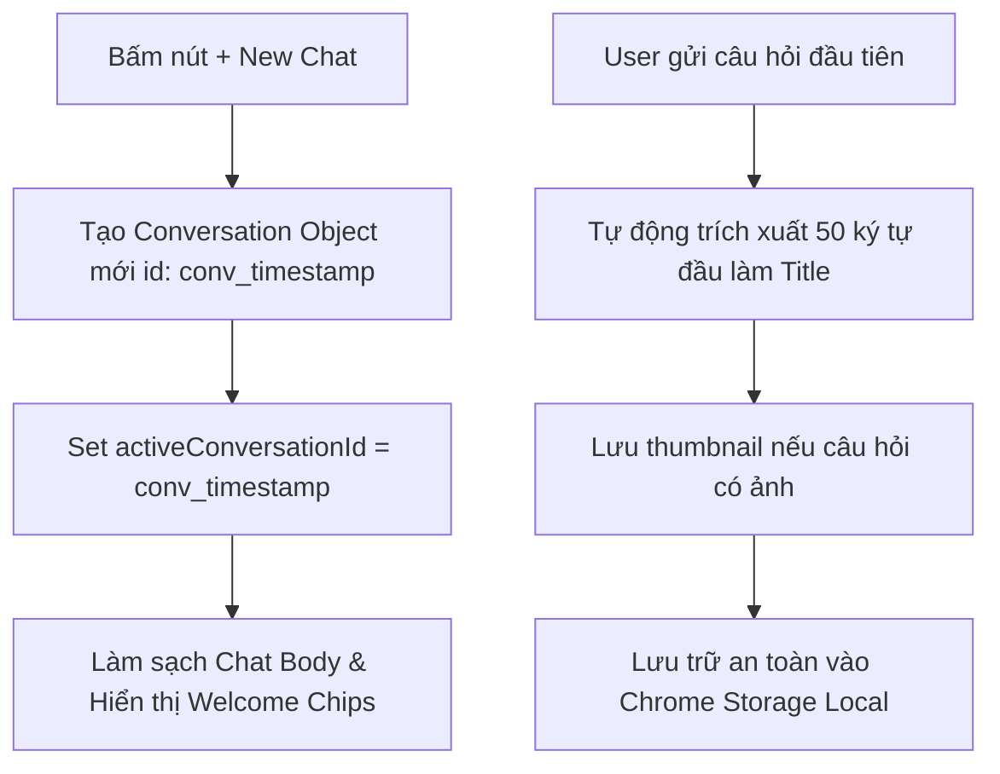

# Tính năng: Ngăn Kéo Chat Học Tập Nổi (Floating Study Drawer)

**Ngăn Kéo Chat Học Tập Nổi (Floating Study Drawer)** là không gian tương tác chính giữa người học và AI, cho phép đặt câu hỏi bằng văn bản, tải ảnh bài tập, xem lịch sử nhiều phiên hội thoại độc lập và tùy biến chế độ sư phạm tức thì ngay trên trang web đang học.

---

## 1. Mô tả Tính năng & Mục đích

- **Mục đích**: Cung cấp một môi trường học tập AI liền mạch mà không cần chuyển sang tab khác hay rời khỏi trang tài liệu/bài giảng đang xem.
- **Điểm nổi bật**:
  - Giao diện Liquid Glass trượt mượt mà từ mép phải màn hình.
  - Hỗ trợ **Đa phiên hội thoại (Multi-Session Threads)** – mỗi bài tập hay chủ đề là một cuộc trò chuyện riêng biệt.
  - Tích hợp bộ biên dịch công thức toán học **KaTeX** trực tiếp trong bong bóng chat.
  - Nút hủy phản hồi (`AbortController`) khi AI đang tạo câu trả lời dài.

---

## 2. Cấu trúc Giao diện & Các Thành phần (UI Anatomy)

```
+-------------------------------------------------------------+
| [Logo] Homework Helper  [Strategy Badge]  [+] [Clock] [x]  | <- Header
+-------------------------------------------------------------+
|                                                             |
|  [Welcome Prompt & Subject Suggestion Action Chips]        |
|                                                             |
|  [User Message Bubble]                                      |
|    - Image Attachment Thumbnail (If any)                    |
|    - Text Question                                          |
|                                                             |
|  [AI Assistant Bubble]                                      |
|    - Step-by-Step Explanation with KaTeX ($...$, $$...$$)   |
|    - Boxed Final Result                                     |
|    - Action Toolbar (Copy Solution, Token Stats)            |
|                                                             |
+-------------------------------------------------------------+
| [Attachment Preview Pill (x)]                               |
| [Textarea: Nhập câu hỏi bài tập...]  [Alt+C] [Upload] [Send]| <- Footer Input
| [Mode Select: Giải từng bước v]  [Language Select: Tiếng Việt]
+-------------------------------------------------------------+
```

### 2.1. Thanh Header Điều khiển
- **Logo & Strategy Badge**: Hiển thị mô hình AI đang trực tiếp xử lý câu hỏi (VD: `Gemini Nano`, `Gemini Flash`, `Round-Robin (3 keys)`).
- **Nút `+` (New Chat)**: Khởi tạo một phiên hội thoại bài tập mới hoàn toàn, làm sạch khung chat và hiển thị lại các chip gợi ý môn học.
- **Nút Đồng hồ (History Drawer)**: Mở danh sách toàn bộ các phiên hỏi bài trước đây để xem lại hoặc chuyển đổi.
- **Nút `x` (Đóng)**: Thu gọn ngăn kéo về mép màn hình.

### 2.2. Khu vực Tin nhắn (Chat Body)
- **Chip Gợi ý Nhanh (Action Chips)**:
  - *Toán học*: "Giải phương trình vi phân", "Tìm nguyên hàm".
  - *Vật lý*: "Tính chu kỳ dao động con lắc", "Định luật bảo toàn".
  - *Hóa học*: "Cân bằng phương trình oxi hóa khử", "Tính pH dung dịch".
  - *Ngoại ngữ*: "Sửa lỗi ngữ pháp đoạn văn", "Giải thích thì hoàn thành".
  - *Người dùng chỉ cần click vào chip để gửi câu hỏi mẫu ngay lập tức.*
- **Render KaTeX thời gian thực**: Các công thức toán học nội dòng `$x^2 + y^2 = r^2$` và công thức khối được định dạng đẹp mắt, rõ ràng.

### 2.3. Khu vực Nhập liệu (Footer Input)
- **Khung soạn thảo tự co giãn (Auto-expanding Textarea)**: Tự động tăng chiều cao theo độ dài câu hỏi người dùng nhập.
- **Đính kèm hình ảnh**:
  - Nhấn nút **Chụp màn hình (`Alt+C`)** để cắt trực tiếp đề bài trên trang web.
  - Nhấn nút **Tải ảnh lên (Upload)** để chọn file ảnh từ máy tính (`.png`, `.jpg`, `.jpeg`, `.webp`).
  - Ảnh đính kèm hiển thị dạng pill thu nhỏ với nút `x` để gỡ bỏ nếu chọn nhầm.
- **Bộ chọn Chế độ Học tập (Study Mode)**: Chuyển đổi nhanh giữa *Giải từng bước*, *Đáp án trực tiếp*, *Gợi ý tự học*, *Giải thích chuyên sâu*, *Dịch thuật*.
- **Bộ chọn Ngôn ngữ Phản hồi (Language Pill)**: Chọn ngôn ngữ AI sẽ trả lời (Tiếng Việt, Tiếng Anh, Tiếng Pháp, Tiếng Trung...).

---

## 3. Kiến trúc Quản lý Đa Hội thoại (Multi-Session Management)

Triển khai tại `extension/shared/storage.js`:



### Chuyển đổi giữa các Hội thoại (Session Switching):
1. Người dùng mở danh sách Lịch sử ➔ Danh sách các phiên trò chuyện xuất hiện kèm hình ảnh và thời gian.
2. Khi click vào phiên bất kỳ ➔ Tiện ích gọi `Storage.switchConversation(convId)`.
3. Hệ thống nạp lại 100% tin nhắn, ảnh và câu trả lời KaTeX của phiên đó vào giao diện ngay lập tức.
4. Tự động cắt tỉa bộ nhớ: Tiện ích chỉ lưu **50 phiên gần nhất** để đảm bảo tốc độ mở nhanh và nhẹ nhất cho máy tính.

---

## 4. Cơ chế Ngắt Luồng Streaming (`AbortController`)

- Khi AI đang giải một bài toán dài mà người dùng muốn dừng lại hoặc đổi câu hỏi:
  - Nút **Send** sẽ tự động chuyển thành nút **Dừng (Stop Circle)** màu đỏ.
  - Khi người dùng nhấn **Dừng**:
    ```javascript
    chrome.runtime.sendMessage({ action: 'ABORT_STREAM', payload: { requestId } });
    ```
  - Background Service Worker lập tức kích hoạt `abortController.abort()`, hủy kết nối fetch và dừng sinh token ngay lập tức, tiết kiệm tối đa tài nguyên máy và hạn ngạch API.

---

## 5. Phím tắt & Cấu hình

- **Phím tắt**: Nhấn **`Alt + K`** (Windows) hoặc **`Command + K`** (Mac) tại bất kỳ trang web nào để bật/tắt ngăn kéo chat.
- **Gửi nhanh**: Nhấn **`Enter`** để gửi câu hỏi, nhấn **`Shift + Enter`** để xuống dòng.
