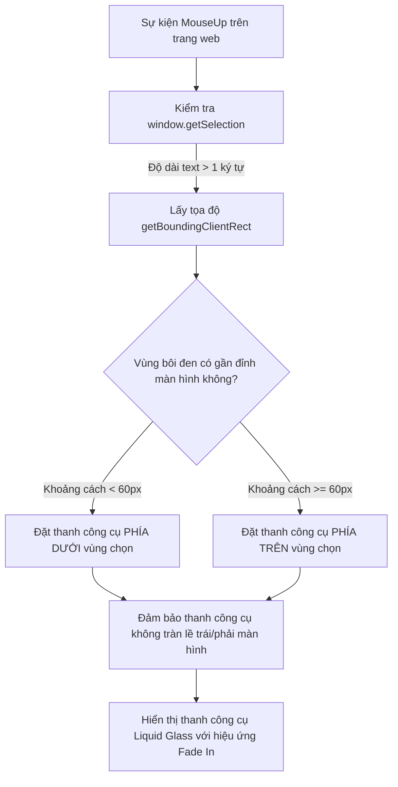

# Tính năng: Thanh Công Cụ Bôi Đen Văn Bản (Selection Quick Toolbar)

**Thanh Công Cụ Bôi Đen Văn Bản (Selection Quick Toolbar)** là tính năng tương tác siêu tốc, tự động xuất hiện ngay trên con trỏ chuột khi người học bôi đen bất kỳ từ vựng, đoạn văn, câu hỏi hay công thức nào trên trang web.

---

## 1. Mô tả Tính năng & Mục đích

- **Mục đích**: Giúp người học tra cứu, dịch nghĩa, tóm tắt bài đọc hoặc kiểm tra ngữ pháp ngay tại chỗ mà không cần sao chép (copy) và dán (paste) thủ công sang các công cụ khác.
- **Vị trí xuất hiện**: Tự động tính toán tọa độ và nổi lên ngay phía trên hoặc phía dưới vùng văn bản được bôi đen.

---

## 2. Chi tiết 5 Tác vụ Nhanh trên Thanh Công Cụ

```
+-------------------------------------------------------------------------+
| [Logo] | [Giải bài / Hỏi AI] | [Dịch] | [Giải thích] | [Tóm tắt] | [Sửa ngữ pháp] | [v] |
+-------------------------------------------------------------------------+
```

### 2.1. Giải Bài Tập / Tìm Kiếm (`Search & Solve`)
- **Biểu tượng**: Sparkles / App Logo
- **Tác vụ**: Đưa trực tiếp câu hỏi vừa bôi đen vào AI để phân tích và đưa ra lời giải logic cùng đáp án chính xác.

### 2.2. Dịch Thuật Học Thuật (`Translate`)
- **Biểu tượng**: Languages / Globe
- **Tác vụ**:
  - Dịch đoạn văn sang ngôn ngữ mà người dùng đã chọn (mặc định: Tiếng Việt).
  - Có thanh chọn nhanh ngôn ngữ đích ngay trong thẻ kết quả để chuyển đổi ngôn ngữ dịch song song.
  - Bảo tồn nguyên vẹn các thuật ngữ chuyên ngành và công thức toán học.

### 2.3. Giải Thích Khái Niệm Chuyên Sâu (`Explain`)
- **Biểu tượng**: Book / Sparkles
- **Tác vụ**: Giải nghĩa từ vựng học thuật, định nghĩa định luật vật lý, phân tích bối cảnh lịch sử, hoặc làm sáng tỏ một thuật ngữ khó hiểu trong bài đọc.

### 2.4. Tóm Tắt Ý Chính (`Summarize`)
- **Biểu tượng**: FileText / List
- **Tác vụ**: Rút gọn các bài báo khoa học, đoạn văn tài liệu dài thành 3-5 gạch đầu dòng then chốt, giúp tiết kiệm thời gian đọc hiểu tài liệu.

### 2.5. Kiểm Tra & Chỉnh Sửa Ngữ Pháp (`Grammar Checker`)
- **Biểu tượng**: CheckCircle / Edit
- **Tác vụ**:
  - Phát hiện các lỗi sai về ngữ pháp, chia thì, chính tả, giới từ trong câu văn tiếng Anh hoặc tiếng Việt.
  - Cung cấp câu đã được sửa hoàn chỉnh và giải thích chi tiết lý do tại sao câu gốc bị sai.

---

## 3. Cơ chế Định vị Thông minh (Smart Positioning Algorithm)

Triển khai tại `extension/content/selection-tooltip.js`:



### Chống nhấp nháy & Tương tác thông minh:
- Nếu người dùng nhấp chuột ra ngoài vùng chọn (văn bản mất bôi đen), thanh công cụ tự động ẩn đi nhẹ nhàng.
- Khi người dùng click vào một tác vụ bất kỳ (VD: Dịch thuật), thanh công cụ phát sự kiện `HOMEWORK_AI_OPEN_POPUP` để mở **Solution Card** với kết quả tương ứng.

---

## 4. Tùy biến Giao diện & Tắt/Bật theo Trang Web

Trong trang **Cài đặt (Options)** ➔ Tab **Giao diện & Tùy biến UI**:

1. **Bật/Tắt Thanh Công Cụ**:
   - Có thể tắt hoàn toàn nếu người dùng không có nhu cầu dùng khi bôi đen text.
2. **5 Chủ đề Màu sắc Liquid Glass (Color Themes)**:
   - `glass-light`: Kính mờ sáng thanh lịch, viền xám bạc.
   - `glass-dark`: Kính mờ tối hiện đại, phong cách Cyberpunk.
   - `cyber-blue`: Tông màu xanh đại dương công nghệ cao.
   - `emerald`: Tông màu ngọc lục bảo dịu mắt.
   - `purple`: Tông màu tím huyền bí, sáng tạo.
3. **Tùy chỉnh Kích thước**:
   - `Compact` (Nhỏ gọn): Dành cho màn hình laptop nhỏ.
   - `Normal` (Tiêu chuẩn): Kích thước cân đối, dễ bấm.
   - `Large` (Lớn): Khoảng cách nút rộng rãi.
4. **Tắt trên các trang web cụ thể (Disable for this site)**:
   - Người dùng có thể nhấn nút "Tắt trên trang web này" từ menu thanh công cụ đối với các website nhập liệu tài liệu hoặc trang làm việc riêng tư.
