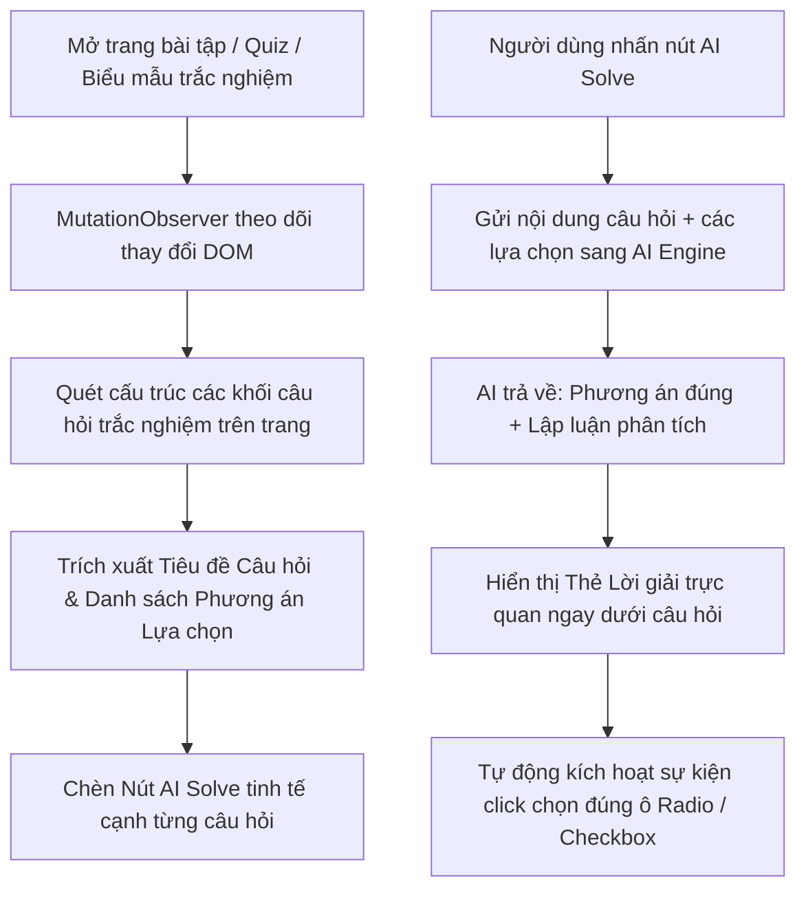

# Tính năng: Trợ Lý Trắc Nghiệm, Hỏi Đáp & Quiz Trực Tuyến (Online Quiz & Form Assistant)

**Trợ Lý Trắc Nghiệm, Hỏi Đáp & Quiz Trực Tuyến (Online Quiz & Form Assistant)** là tính năng thông minh hỗ trợ người dùng tự động phân tích câu hỏi trắc nghiệm, các bài kiểm tra khảo sát, biểu mẫu trực tuyến, đưa ra lập luận phân tích chi tiết và hỗ trợ tự động chọn đáp án chuẩn xác.

---

## 1. Mô tả Tính năng & Mục đích

- **Mục đích**: Hỗ trợ người dùng kiểm tra nhanh kiến thức, đối chiếu kết quả khi làm các bài tập trắc nghiệm, bài khảo sát, câu hỏi trắc nghiệm nhiều lựa chọn trên các nền tảng trực tuyến.
- **Tác vụ hỗ trợ**:
  - Tự động nhận diện câu hỏi và các phương án lựa chọn A, B, C, D trên trang web.
  - Phân tích đề bài và loại trừ các phương án gây nhiễu.
  - Đưa ra lời giải thích ngắn gọn, súc tích vì sao chọn phương án đó.
  - Hỗ trợ kích hoạt tự động điền / chọn đáp án trực tiếp vào giao diện bài thi.

---

## 2. Cách thức Hoạt động & Kiến trúc Quét DOM (DOM Scanner Engine)

Triển khai tại `extension/content/forms-adapter.js`:



### 2.1. Cấu trúc Trích xuất Dữ liệu Câu hỏi:
Tiện ích tự động bóc tách các thành phần của một câu hỏi trắc nghiệm:
1. **Nội dung câu hỏi**: Tự động quét tiêu đề, đoạn văn mô tả và các bảng biểu/công thức đi kèm.
2. **Hình ảnh minh họa** (nếu có): Quét các thẻ ảnh trong khối câu hỏi để chuyển sang dạng hình ảnh đa phương thức gửi cho AI.
3. **Danh sách các lựa chọn (Options)**:
   - Các nút chọn một đáp án duy nhất (Radio buttons).
   - Các ô chọn nhiều đáp án cùng lúc (Checkboxes).
   - Danh sách thả xuống (Dropdown selects).

---

## 3. Quy trình Phân tích & Tự động Chọn Đáp án (Answer Resolution)

Khi AI hoàn thành việc phân tích câu hỏi:
1. AI trả về kết quả có cấu trúc:
   - `ĐÁP ÁN: [Nội dung phương án đúng]`
   - `GIẢI THÍCH: [Lập luận loại trừ và căn cứ lựa chọn]`
2. Tiện ích so khớp nội dung đáp án của AI với danh sách các nhãn (text labels) của các phương án trên trang:
   ```javascript
   const targetOption = Array.from(options).find(opt => 
     opt.textContent.trim().toLowerCase().includes(aiAnswer.toLowerCase())
   );
   ```
3. Kích hoạt chuỗi sự kiện chuột (`MouseEvent: mousedown ➔ mouseup ➔ click`) trên phần tử tương ứng để hệ thống ghi nhận lựa chọn một cách mượt mà và tự nhiên.

---

## 4. Xử lý các Dạng Bài Đa dạng (Complex Scenarios)

1. **Biểu mẫu Nhiều Trang (Paginated Forms)**:
   - Khi chuyển trang câu hỏi tiếp theo, `MutationObserver` tự động phát hiện các câu hỏi mới được render vào DOM và ngay lập tức gắn các nút **AI Solve** mới mà không cần tải lại trang.
2. **Câu hỏi có Hình ảnh Minh họa**:
   - Nếu câu hỏi có hình ảnh, tiện ích tự động chuyển đổi ảnh sang Base64 và truyền cho mô hình Vision AI để đọc hiểu đồng thời cả chữ lẫn hình.
3. **Câu hỏi Chọn Nhiều Đáp án**:
   - AI tự động nhận diện câu hỏi dạng *"Chọn tất cả các phương án đúng"* và kích hoạt chọn đồng thời nhiều ô checkbox tương ứng.

---

## 5. Cấu hình & Bật/Tắt

Trong trang **Cài đặt (Options)** ➔ Tab **Cài đặt Chung (`tabGeneral`)**:
- Người dùng có thể chủ động bật hoặc tắt tính năng **"Trợ lý Trắc nghiệm & Quiz Trực tuyến"** bất cứ lúc nào tùy theo nhu cầu làm việc của mình.
