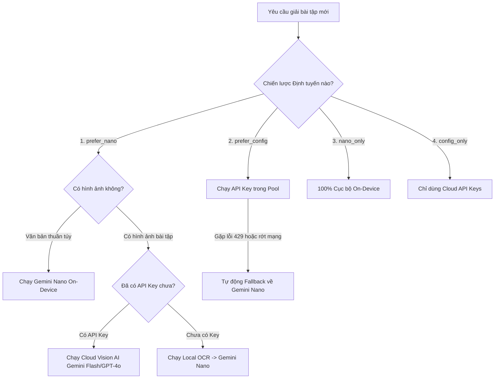
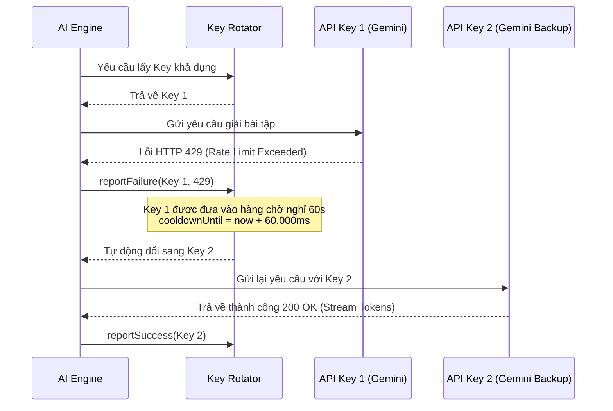

# Tính năng: Định Tuyến AI Đa Chiến Lược & Xoay Vòng Key Pool (AI Routing & Key Rotator)

Hệ thống **Định Tuyến AI Đa Chiến Lược & Xoay Vòng Key Pool** là "trái tim" điều phối toàn bộ quá trình suy luận của **Homework Helper**, đảm bảo việc học tập của người dùng không bao giờ bị gián đoạn do lỗi mạng, hết hạn ngạch (Rate Limit) hay lỗi API.

---

## 1. Mô tả 4 Chiến lược Định tuyến AI (AI Routing Strategies)

Người dùng có thể lựa chọn 1 trong 4 chiến lược vận hành tại trang **Cài đặt (Options)** ➔ Thẻ **Chiến lược Định tuyến AI**:

### Chi tiết 4 Chiến lược:
1. **`prefer_nano` (Ưu tiên Gemini Nano - Mặc định)**:
   - *Văn bản / Chat / Bôi đen text*: Chạy 100% trên **Chrome Gemini Nano** On-Device (Tốc độ mili-giây, không tốn token, bảo mật riêng tư).
   - *Hình ảnh / Chụp đề bài*: Tự động định tuyến sang **Gemini 2.5 Flash / GPT-4o Vision** (hoặc chạy Local OCR nếu người dùng không cài API key).
2. **`prefer_config` (Ưu tiên Model đã Cấu hình)**:
   - Ưu tiên sử dụng danh sách các API Key đám mây đã cấu hình.
   - Khi gặp sự cố mạng, lỗi 429 Rate Limit hoặc hết hạn ngạch ➔ **Tự động Fallback sang Gemini Nano** mà không làm gián đoạn trải nghiệm của người dùng.
3. **`nano_only` (Chỉ dùng Gemini Nano)**:
   - 100% Cục bộ On-Device. Tuyệt đối không gửi bất kỳ dữ liệu nào ra máy chủ bên ngoài.
4. **`config_only` (Chỉ dùng Model Config)**:
   - Chỉ sử dụng các API Key được cấp trong bảng Key Pool.

---

## 2. Danh sách Nhà Cung Cấp & Mô hình Hỗ trợ (Supported Providers)

| Nhà Cung Cấp | ID Provider | Các Model Tiêu Biểu | Điểm Mạnh Nổi Bật |
| :--- | :--- | :--- | :--- |
| **Chrome Built-in AI** | `chrome-builtin` | `Gemini Nano (On-Device)` | 100% Offline, không cần API key, bảo mật tuyệt đối. |
| **Google Gemini** | `gemini` | `gemini-2.5-flash`, `gemini-2.5-flash-lite`, `gemini-1.5-pro` | Gói miễn phí 1.500 lượt/ngày; đọc hiểu hình vẽ toán học và đồ thị xuất sắc nhất. |
| **Groq Cloud** | `groq` | `llama-3.3-70b-versatile`, `deepseek-r1-distill-llama-70b` | Tốc độ suy luận siêu tốc (>300 tokens/s), hỗ trợ model suy luận R1. |
| **DeepSeek Platform** | `deepseek` | `deepseek-chat` (V3), `deepseek-reasoner` (R1) | Khả năng suy luận toán học và logic chuyên sâu cho bài tập nâng cao. |
| **OpenAI** | `openai` | `gpt-4o`, `gpt-4o-mini`, `o1-mini` | Khả năng lập luận tổng quát và viết code giải toán mạnh mẽ. |
| **Anthropic** | `claude` | `claude-3-5-sonnet-20241022`, `claude-3-5-haiku` | Khả năng hành văn sư phạm mạch lạc, phân tích bài đọc hiểu ngữ văn sâu sắc. |
| **OpenRouter / Tùy chỉnh** | `openrouter` / `custom` | Bất kỳ Model nào hỗ trợ OpenAI Chat Format | Hỗ trợ trỏ đến các máy chủ AI cục bộ (Ollama, vLLM, LMStudio). |

---

## 3. Thuật toán Cân bằng Tải & Tự ngắt Mạch (Key Rotator & Circuit Breaker)

Triển khai tại `extension/background/key-rotator.js`:

### Điểm Vượt Trội:
- **Người dùng không bị gián đoạn**: Khi một key bị hết lượt, người học không phải vào cài đặt đổi key thủ công, hệ thống tự động xoay key và hiển thị thông báo nhẹ: *`"[Thông báo] Key gặp giới hạn, tự động xoay sang key dự phòng..."`*.
- **Tự động phục hồi (Self-Healing)**: Sau khi hết thời gian chờ 60 giây, key bị lỗi sẽ tự động được phục hồi trạng thái sẵn sàng để tiếp tục phục vụ các câu hỏi tiếp theo.

---

## 4. Quản lý Nhiều Key & Bảo mật (Key Pool Management)

Trong trang **Cài đặt (Options)** ➔ Tab **AI Providers & Keys**:
- **Thêm Key mới không giới hạn**: Nhấn nút `+ Thêm Model & Key`.
- **Bật/Tắt từng Key**: Có ô Checkbox để tạm dừng một key mà không cần xóa đi.
- **Ẩn Key an toàn**: Chuỗi API Key được hiển thị dưới dạng dấu chấm `••••••••` và chỉ lưu trong bộ nhớ máy cục bộ (`chrome.storage.local`), không gửi đi bất kỳ máy chủ nào khác.
- **Chọn Chế độ Cân bằng tải**:
  - `Round-Robin`: Chia đều lần lượt từng key.
  - `Random`: Chọn ngẫu nhiên key bất kỳ trong danh sách.
  - `Chỉ định 1 Key cố định`: Chỉ dùng duy nhất một mô hình yêu thích (VD: chỉ dùng GPT-4o hoặc chỉ dùng Gemini Flash).
