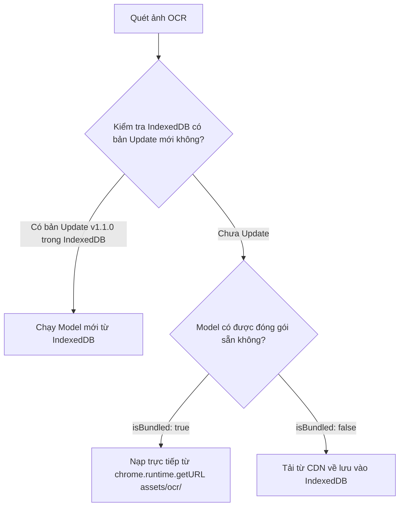

# Tính năng: Bộ Máy Local WebAssembly OCR & Quản Lý Model (Local OCR Engine)

Bộ máy **Local WebAssembly OCR** của **Homework Helper** cho phép quét chữ và công thức toán học từ ảnh chụp màn hình chạy 100% cục bộ trên trình duyệt mà không cần gửi ảnh lên bất kỳ máy chủ đám mây nào.

---

## 1. Mô tả Tính năng & Mục đích

- **Mục đích**: Bổ sung "mắt thần thị giác" cho các mô hình AI chỉ xử lý văn bản như **Chrome Gemini Nano**, giúp người học giải được bài tập qua ảnh chụp ngay cả khi máy tính bị ngắt mạng Internet (100% Offline).
- **Công nghệ nền tảng**: Tesseract.js WebAssembly với các tệp trọng số mô hình đã được lượng tử hóa (Quantized 8-bit LSTM `tessdata_fast`), tối ưu hóa tối đa cho tốc độ quét trên trình duyệt.

---

## 2. Danh Mục Toàn Bộ 13 Model Ngôn Ngữ & Toán Học (Model Catalog)

| STT | Tên Model | Mã Tesseract | Dung lượng | Trạng thái Mặc định | Chức năng Nhận diện |
| :---: | :--- | :---: | :---: | :---: | :--- |
| **⭐ GÓI CỐT LÕI (CORE BUNDLED)** | | | | | |
| **1** | **Tiếng Việt** | `vie` | **531 KB** | **Tích hợp sẵn v1.0.0** | Quét đề thi, trắc nghiệm, bài tập tiếng Việt (Toán, Văn, Sử, Địa, Sinh...). |
| **2** | **Tiếng Anh** | `eng` | **4.1 MB** | **Tích hợp sẵn v1.0.0** | Quét bài tập tiếng Anh, tài liệu quốc tế, biến số Latin ($x, y, z$). |
| **3** | **Toán học & Ký hiệu** | `equ` | **2.3 MB** | **Tích hợp sẵn v1.0.0** | Quét ký hiệu Hy Lạp ($\alpha, \beta, \pi, \Delta$), căn bậc hai, tích phân, phân số, chỉ số. |
| **🌐 TOÀN BỘ CÁC NGÔN NGỮ QUỐC TẾ (TẢI THEO NHU CẦU - ON-DEMAND)** | | | | | |
| **4** | **Tiếng Trung Giản thể** | `chi_sim` | ~4.2 MB | Tải theo nhu cầu | Nhận diện chữ Hán giản thể (简体中文) trong đề bài tiếng Trung. |
| **5** | **Tiếng Trung Phồn thể** | `chi_tra` | ~4.8 MB | Tải theo nhu cầu | Nhận diện chữ Hán phồn thể (繁體中文). |
| **6** | **Tiếng Nhật** | `jpn` | ~4.6 MB | Tải theo nhu cầu | Nhận diện hệ chữ Kanji, Hiragana, Katakana (日本語). |
| **7** | **Tiếng Hàn** | `kor` | ~3.9 MB | Tải theo nhu cầu | Nhận diện chữ Hangul (한국어). |
| **8** | **Tiếng Tây Ban Nha** | `spa` | ~3.2 MB | Tải theo nhu cầu | Nhận diện tiếng Tây Ban Nha (Español) có dấu trọng âm. |
| **9** | **Tiếng Pháp** | `fra` | ~3.8 MB | Tải theo nhu cầu | Nhận diện tiếng Pháp (Français) với các ký tự đặc biệt. |
| **10** | **Tiếng Đức** | `deu` | ~3.7 MB | Tải theo nhu cầu | Nhận diện tiếng Đức (Deutsch) với các ký tự Umlaut. |
| **11** | **Tiếng Bồ Đào Nha** | `por` | ~3.3 MB | Tải theo nhu cầu | Nhận diện tiếng Bồ Đào Nha (Português). |
| **12** | **Tiếng Indonesia** | `ind` | ~2.8 MB | Tải theo nhu cầu | Nhận diện bài tập tiếng Indonesia / Mã Lai. |
| **13** | **Tiếng Nga** | `rus` | ~4.0 MB | Tải theo nhu cầu | Nhận diện hệ chữ cái Kirin (Русский - Cyrillic). |

---

## 3. Kiến trúc Quản lý Phiên bản & Bộ nhớ Đệm IndexedDB

Triển khai tại `extension/shared/ocr-engine.js`:



### 3.1. Cơ chế Tải về & Tiến trình % Thời Gian Thực:
- Khi người dùng nhấn nút **"Tải về"** cho một ngôn ngữ:
  - Hệ thống tải trực tiếp từ CDN `https://cdn.jsdelivr.net/gh/naptha/tessdata@gh-pages/4.0.0_fast/...`.
  - Thanh tiến trình hiển thị tỷ lệ `%` và dung lượng đã tải thời gian thực.
  - Sau khi tải xong, tệp nhị phân được lưu vào Object Store `traineddata_models` của database `HomeworkAi_Ocr_DB` trong IndexedDB.

### 3.2. Nút Tải nhanh Gói Cốt Lõi (1-Click Download):
- Nút **"Tải Gói Cốt Lõi (Vie + Eng + Math)"** cho phép người dùng tải đồng bộ 3 model cơ bản nhất chỉ trong 2-3 giây nếu chưa có.

### 3.3. Kiểm tra Bản Cập Nhật (Check for Updates):
- Nút **"Kiểm tra Cập nhật"** tự động đối chiếu số phiên bản hiện tại của từng model với phiên bản mới nhất trên kho lưu trữ.
- Nếu có phiên bản mới cải thiện độ chính xác, hệ thống sẽ thông báo để người dùng cập nhật chỉ với 1 click.

---

## 4. Cơ chế Nhận diện Kết hợp & Hậu kỳ Công thức Toán LaTeX

### 4.1. Ghép Ngôn ngữ Đa Tầng (Composite Language String):
Khi người dùng chụp ảnh một bài toán bằng tiếng Việt có chứa công thức tiếng Anh và ký hiệu Hy Lạp, tiện ích sẽ tự động ghép bộ 3 mã ngôn ngữ:
```javascript
// Ví dụ: Ngôn ngữ đang chọn là Tiếng Việt
const compositeLang = 'vie+equ+eng';
```
Giúp bộ máy OCR cùng một lúc nhận diện được cả chữ tiếng Việt có dấu, biến số Latin $x, y$ và các ký hiệu toán học đặc biệt.

### 4.2. Bộ lọc Xử lý Hậu kỳ (Math Regex Post-Processing):
Các ký tự sau khi quét từ ảnh được đưa qua bộ chuẩn hóa công thức:
- Căn bậc hai: `V(x + 1)` ➔ `$\sqrt{x + 1}$`
- Số mũ: `x2`, `y3`, `a4` ➔ `$x^2$`, `$y^3$`, `$a^4$`
- Ký tự Hy Lạp: `alpha`, `beta`, `pi`, `delta` ➔ `$\alpha$`, `$\beta$`, `$\pi$`, `$\Delta$`
- Đóng gói chuẩn LaTeX: Tự động bọc trong dấu `$...$` để thư viện KaTeX hiển thị đẹp mắt.
