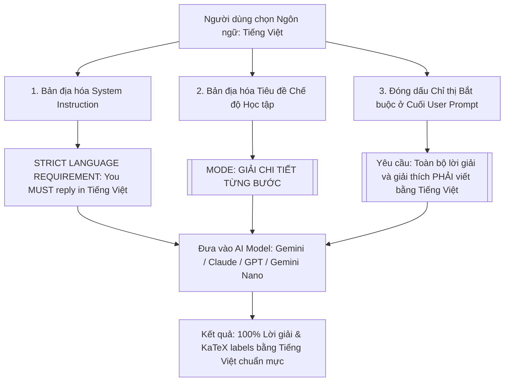

# Tính năng: Cưỡng Chế Đa Ngôn Ngữ & Bản Địa Hóa (Multilingual Engine)

Hệ thống **Cưỡng Chế Đa Ngôn Ngữ & Bản Địa Hóa (Multilingual Output Engine)** của **Homework Helper** giải quyết triệt để bài toán các mô hình AI (như Gemini, GPT-4o, Claude, đặc biệt là Gemini Nano On-Device) hay bị "trôi" về phản hồi bằng tiếng Anh khi gặp đề bài có từ vựng tiếng Anh.

---

## 1. Vấn Đề Thực Tế & Cơ Chế Cưỡng Chế Ngôn Ngữ Kép (Dual Enforcement)

### 1.1. Vấn đề của các mô hình LLM thông thường:
- Hầu hết các mô hình ngôn ngữ lớn (LLM) được huấn luyện chủ yếu bằng dữ liệu tiếng Anh.
- Nếu mẫu chỉ thị bài toán (Prompt Template) viết bằng tiếng Anh (ví dụ: `[MODE: STEP-BY-STEP SOLUTION] Please solve this homework question...`), mô hình AI sẽ tự động phản hồi lại bằng tiếng Anh ngay cả khi người dùng mong muốn đọc lời giải bằng tiếng Việt.

### 1.2. Giải pháp Cưỡng Chế Ngôn Ngữ Kép của Homework Helper:

---

## 2. Danh Sách 12+ Ngôn Ngữ Đầu Ra Hỗ Trợ

| Mã Ngôn Ngữ | Tên Hiển Thị | Tên Bản Ngữ (Native) | Định dạng Cưỡng chế Hệ thống |
| :---: | :--- | :--- | :--- |
| `vi` | **Tiếng Việt** *(Mặc định)* | Tiếng Việt | `Tiếng Việt (Vietnamese)` |
| `en` | **Tiếng Anh** | English | `English` |
| `zh-CN`| **Tiếng Trung Giản thể** | 简体中文 | `Simplified Chinese (简体中文)` |
| `zh-TW`| **Tiếng Trung Phồn thể** | 繁體中文 | `Traditional Chinese (繁體中文)` |
| `ja` | **Tiếng Nhật** | 日本語 | `Japanese (日本語)` |
| `ko` | **Tiếng Hàn** | 한국어 | `Korean (한국어)` |
| `es` | **Tiếng Tây Ban Nha** | Español | `Español (Spanish)` |
| `fr` | **Tiếng Pháp** | Français | `Français (French)` |
| `de` | **Tiếng Đức** | Deutsch | `Deutsch (German)` |
| `pt` | **Tiếng Bồ Đào Nha** | Português | `Portuguese (Português)` |
| `id` | **Tiếng Indonesia** | Bahasa Indonesia | `Bahasa Indonesia` |
| `ru` | **Tiếng Nga** | Русский | `Russian (Русский)` |

---

## 3. Bản Địa Hóa Giao Diện Động (Dynamic UI Localization)

Triển khai tại `extension/shared/i18n.js`:
- Toàn bộ nhãn nút, placeholder ô nhập liệu, thông báo hướng dẫn và các chip gợi ý môn học trong khung Chat Drawer tự động chuyển đổi theo ngôn ngữ người dùng chọn:
  - *Khi chọn Tiếng Việt*: Placeholder hiển thị `"Nhập câu hỏi bài tập hoặc dán ảnh vào đây..."`, nút bấm `"Hỏi Trợ Lý AI"`.
  - *Khi chọn Tiếng Anh*: Placeholder hiển thị `"Ask a homework question or paste an image..."`, nút bấm `"Ask AI Helper"`.
  - *Khi chọn Tiếng Pháp*: Placeholder hiển thị `"Posez une question ou collez une image..."`.

---

## 4. Áp Dụng Đồng Bộ Trên Tất Cả Các Luồng Xử Lý

Cơ chế ngôn ngữ được truyền xuyên suốt và kiểm soát chặt chẽ trên mọi kênh tương tác:
1. **Luồng Chụp ảnh Crop & Solve**: Tự động sinh lời giải bằng ngôn ngữ đã chọn.
2. **Luồng Chat Trực tiếp (Floating Drawer & Side Panel)**: Tự động đổi ngôn ngữ ngay từ câu hỏi kế tiếp khi người dùng đổi lựa chọn trên Language Pill.
3. **Luồng Bôi đen Văn bản (Selection Tooltip)**: Tác vụ Dịch thuật và Giải thích tuân thủ chính xác ngôn ngữ đích.
4. **Luồng Gemini Nano On-Device**: Bắn kèm chỉ thị ngôn ngữ qua `main-world-bridge.js` để Gemini Nano trả lời chuẩn tiếng Việt không bị lai tạp tiếng Anh.
